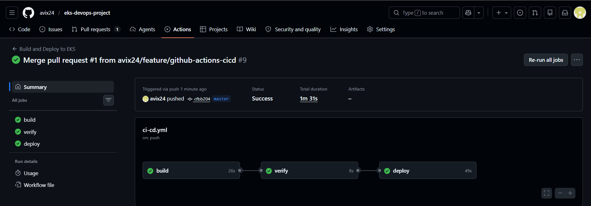
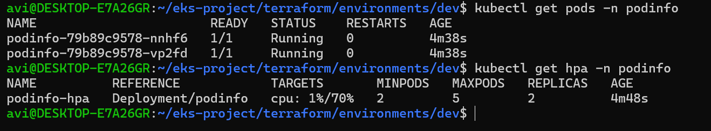
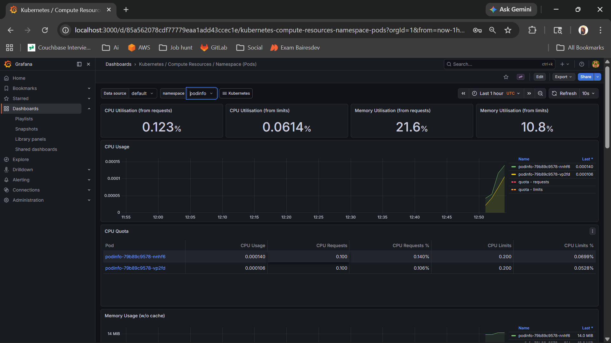
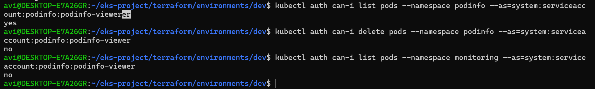
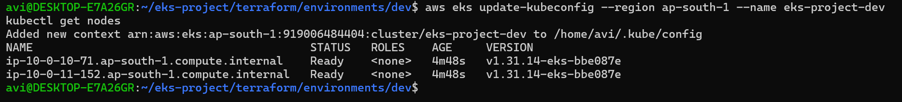
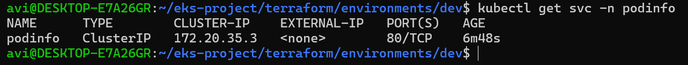
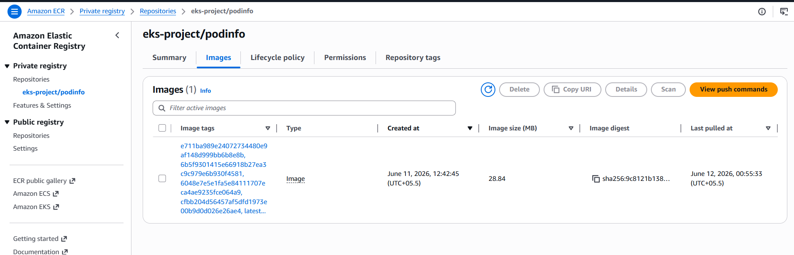

# 🚀 Production-Grade Microservices Deployment on AWS EKS

## 📌 Overview
End-to-end DevOps project demonstrating a production-grade microservices 
deployment on AWS EKS using Infrastructure as Code, CI/CD automation, 
container orchestration, and observability — simulating a real-world 
production setup.

## ❗ Problem Statement
Manually deploying applications on Kubernetes leads to:
- Inconsistent environments
- Configuration drift
- Lack of deployment traceability
- Difficult rollbacks

**This project solves these by implementing:**
- Terraform for reproducible infrastructure
- Helm for versioned, rollback-capable deployments
- CI/CD pipeline for automated delivery
- Monitoring stack for full observability

---

## 🏗️ Architecture
```
Developer → GitLab
                ↓
          CI/CD Pipeline
          ├── Build: Docker image → AWS ECR
          ├── Verify: Image exists in ECR
          └── Deploy: Helm upgrade → AWS EKS
                          ↓
                   AWS EKS Cluster
                   ├── podinfo namespace
                   │   ├── Deployment (2-5 pods)
                   │   ├── Service (ClusterIP)
                   │   ├── ConfigMap
                   │   ├── HPA (70% CPU threshold)
                   │   └── RBAC (read-only ServiceAccount)
                   └── monitoring namespace
                       ├── Prometheus
                       └── Grafana
```

---

## 🛠️ Tech Stack
| Category | Tools |
|---|---|
| Cloud | AWS (EKS, ECR, S3, IAM, VPC) |
| Infrastructure as Code | Terraform (Modular) |
| Containerization | Docker |
| Orchestration | Kubernetes, Helm |
| CI/CD | GitLab CI/CD |
| Monitoring | Prometheus, Grafana |
| Security | RBAC, AWS IAM |

---

## 📁 Project Structure
```
eks-project/
├── terraform/
│   ├── modules/
│   │   ├── vpc/        # VPC, subnets, IGW, NAT Gateway
│   │   ├── eks/        # EKS cluster, node groups
│   │   └── iam/        # IAM roles and policies
│   └── environments/
│       └── dev/        # Dev environment configuration
├── helm/
│   └── podinfo/
│       ├── Chart.yaml
│       ├── values.yaml
│       └── templates/
│           ├── deployment.yaml
│           ├── service.yaml
│           ├── configmap.yaml
│           ├── hpa.yaml
│           └── rbac.yaml
├── images/             # Project screenshots
├── .gitlab-ci.yml      # CI/CD pipeline
└── Dockerfile
```

---

## ⚙️ Key Features

### 🏗️ Infrastructure (Terraform)
- Modular design — separate modules for VPC, EKS, IAM
- Remote state stored in S3 with versioning enabled
- DynamoDB locking to prevent concurrent state corruption
- Custom VPC with public/private subnets across 2 availability zones
- EKS worker nodes in private subnets (security best practice)
- NAT Gateway for secure outbound internet access

### 🚀 CI/CD Pipeline (GitLab)
Three-stage automated pipeline triggered on every commit:
- **Build** — Docker image built and pushed to ECR with commit SHA tag
- **Verify** — Confirms image exists in ECR before deployment
- **Deploy** — Helm upgrade with zero-downtime rolling update



### ☸️ Application Deployment (Helm)
- Custom Helm chart with parameterized values
- Liveness and readiness probes configured
- Resource requests and limits on all containers
- ConfigMap for environment-specific configuration
- Horizontal Pod Autoscaler — scales 2 to 5 replicas at 70% CPU



### 📊 Monitoring (Prometheus + Grafana)
- kube-prometheus-stack deployed via Helm
- Prometheus scrapes pod metrics every 15 seconds
- Grafana dashboards for real-time CPU and memory visualization
- Node Exporter for hardware-level metrics per worker node



### 🔐 Security (RBAC)
- Namespace isolation — application vs monitoring
- Read-only ServiceAccount scoped to podinfo namespace only
- Role with minimum permissions — get, list, watch only
- Verified with kubectl auth can-i



---

## 🧪 Proof of Deployment

### Cluster — Running Nodes


### Services


### ECR — Images with Commit SHA Tags


---

## ⚠️ Real Challenges Faced

- **EKS Node Group failed** with `InvalidParameterCombination` —
  t3.medium not free-tier eligible. Switched to t3.small which meets
  minimum EKS memory requirements.

- **Kubernetes version deprecation** — AMI for v1.29 no longer supported
  by AWS. Upgraded to v1.31. Learned that live cluster upgrades can only
  go one minor version at a time.

- **HPA showed `<unknown>` for CPU** — Metrics Server not installed by
  default on EKS. Installed separately. Learned EKS doesn't include it
  out of the box.

- **GitLab pipeline build stage failed** — Alpine Linux + Python 3.12
  pyexpat conflict. Fixed by switching to GitLab's official aws-base
  image with non-TLS Docker daemon connection.

- **Git push rejected** — remote was ahead of local after editing
  pipeline in GitLab UI. Fixed with git pull before push.

---

## 🚀 How to Run

### Prerequisites
- AWS account with required permissions
- Terraform >= 1.0
- kubectl
- Helm >= 3.0
- GitLab account with CI/CD variables configured

### 1️⃣ AWS Setup (One time manual steps)
```bash
# Create S3 bucket for remote state
# Create DynamoDB table for state locking
# Create ECR repository: eks-project/podinfo
# Configure GitLab CI/CD variables
```

### 2️⃣ Provision Infrastructure
```bash
cd terraform/environments/dev
terraform init
terraform plan
terraform apply
```

### 3️⃣ Configure kubectl
```bash
aws eks update-kubeconfig --region ap-south-1 --name eks-project-dev
kubectl get nodes
```

### 4️⃣ Install Metrics Server
```bash
kubectl apply -f https://github.com/kubernetes-sigs/metrics-server/releases/latest/download/components.yaml
```

### 5️⃣ Create Namespace
```bash
kubectl create namespace podinfo
```

### 6️⃣ Trigger Pipeline
Push any change to GitLab master branch — pipeline automatically:
- Builds Docker image
- Pushes to ECR
- Deploys to EKS via Helm

### 7️⃣ Setup Monitoring
```bash
helm repo add prometheus-community https://prometheus-community.github.io/helm-charts
helm repo update
kubectl create namespace monitoring
helm install monitoring prometheus-community/kube-prometheus-stack \
  --namespace monitoring \
  --set prometheus.prometheusSpec.serviceMonitorSelectorNilUsesHelmValues=false \
  --set grafana.adminPassword=admin123 \
  --set grafana.service.type=ClusterIP
```

### 8️⃣ Access Grafana
```bash
kubectl port-forward svc/monitoring-grafana 3000:80 -n monitoring
# Open: http://localhost:3000
# Username: admin | Password: admin123
```

### 9️⃣ Cleanup
```bash
helm uninstall monitoring -n monitoring
helm uninstall podinfo -n podinfo
cd terraform/environments/dev
terraform destroy
```

---

## 🔮 Future Improvements
- Add Ingress Controller (AWS ALB) for external access
- Enable HTTPS via AWS Certificate Manager
- Implement GitOps with ArgoCD
- Add multi-environment support (dev/staging/prod)
- Migrate secrets to AWS Secrets Manager
- Add pod disruption budgets for high availability

---

## 💡 Key Takeaways
- Terraform ensures consistent and reproducible infrastructure
- Helm enables versioned and rollback-capable deployments
- CI/CD eliminates manual deployment steps and human error
- Monitoring provides real-time visibility into system health
- RBAC enforces principle of least privilege across namespaces
